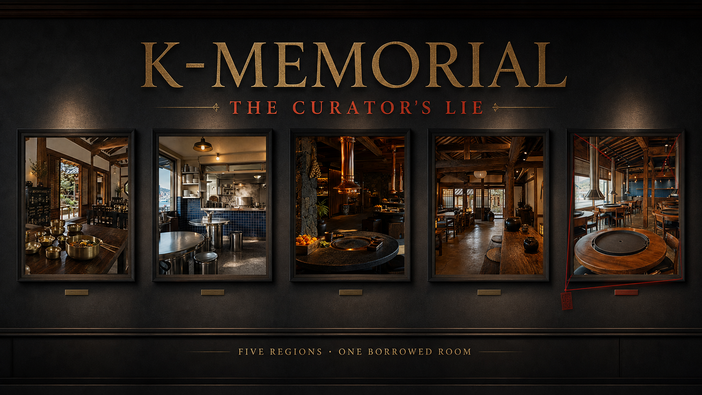

# K-Memorial — The Curator's Lie

[한국어](README_KO.md)

> Private demo: https://k-memorial-hidden-table.ant-probe.chatgpt.site

K-Memorial is an AI-assisted visual logic game built around representative Korean restaurant interiors. Five regional dining rooms enter the archive, but one is an AI composite that has borrowed another region's visual signature. Players compare architecture, materials, tableware, recurring seals, and the curator's testimony to identify the room that cannot belong.



## Case 001 — The Borrowed Room

- Five AI-generated restaurant scenes: Jeonju, Busan, Jeju, Andong, and Chuncheon
- One logically verified composite
- Five curator statements with exactly one false claim
- Ten-minute investigation, three progressive hints, and three accusation attempts
- Full-screen inspection with adjustable magnification

## How to Play

1. Select **Enter the Archive** to open the case.
2. Inspect all five restaurant scenes and zoom in on regional evidence.
3. Compare wall materials, architecture, cookware, tableware, and memory seals.
4. Mark any curator statement that appears suspicious.
5. Choose one room and select **Accuse This Room**.
6. Close the case before time or accusation attempts run out.

## Design Principle

AI creates each restaurant atmosphere from a structured regional brief. Deterministic game data controls the clues, seal counts, statements, and answer, ensuring the case has one verifiable solution without asking an AI model to judge the player.

## Tech Stack

- Next.js 16, React 19, and TypeScript 5
- vinext and Vite 8
- Responsive CSS gallery, overlays, and zoom interaction
- OpenAI-generated raster restaurant scenes
- OpenAI Sites private hosting
- Node.js 22 or later

## Run Locally

```bash
npm install
npm run dev
```

## Build and Test

```bash
npm run build
npm test
```

## Project Structure

```text
k-memorial/
  app/
    page.tsx
    globals.css
    layout.tsx
  public/
    assets/restaurants/
    og.png
  tests/
    rendered-html.test.mjs
```

## Planned Work

- Expand the archive to 30 representative Korean restaurant settings
- Add cases using ordering, parity, conditional, and self-referential logic
- Validate future cases with a constraint solver before publication
- Add a visual deduction notebook and case history
- Support community-authored cases with AI-assisted art direction
