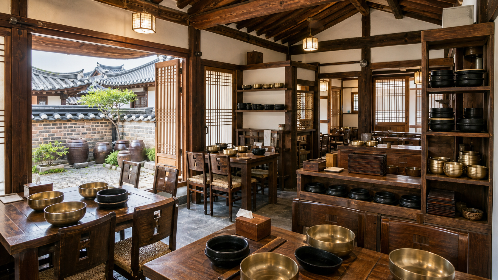

# K-Memorial — Hidden Table

[English](README.md)

> 비공개 데모: https://k-memorial-hidden-table.ant-probe.chatgpt.site
> 현재 빌드: Basic 01 — 전주 비빔밥집

K-Memorial은 한국의 음식 문화를 소재로 한 숨은그림찾기 게임입니다.
플레이어는 한국 음식점의 풍경을 탐색하며 제사상에 올라가는 음식을 찾고,
수집한 음식으로 문화 컬렉션을 완성합니다.

현재 빌드는 전주 한옥마을의 비빔밥집을 배경으로 제작한 1개 스테이지
프로토타입입니다. Basic Collection을 30개로 확장하기 전에 탐색, 돋보기,
미니맵, 힌트, 점수와 한영 문화 설명의 핵심 흐름을 테스트합니다.



## 배포 사이트

- 비공개 데모: https://k-memorial-hidden-table.ant-probe.chatgpt.site
- 스테이지: `Basic 01 / 30`
- 제한시간: 4분
- 숨은 음식: 5개
- 사용 가능한 힌트: 3회

## 게임 방법

1. **Enter the restaurant**를 눌러 4분 타이머를 시작합니다.
2. 우측 목표 목록에 표시된 음식 5개를 식당 안에서 찾습니다.
3. **Magnifier**가 켜진 상태에서 포인터를 움직여 배경의 세부 영역을
   확대합니다.
4. 목표 목록의 음식을 선택하면 **Memory Map**에서 대략적인 탐색 구역을
   확인할 수 있습니다.
5. 찾기 어렵다면 **A memory trace**를 눌러 잠시 표시되는 힌트를 사용합니다.
   힌트는 최대 3회 사용할 수 있습니다.
6. 배경에 숨겨진 음식을 선택하면 컬렉션에 추가됩니다.
7. 시간이 끝나기 전에 음식 5개를 모두 찾아 첫 번째 상차림 원칙인
   **홍동백서**를 완성합니다.

음식이 없는 곳을 선택하면 오답 횟수가 증가합니다. 사용한 시간, 오답과
힌트 횟수가 최종 점수에 반영됩니다.

## 조작 방법

- 마우스 또는 터치: 숨은 음식 선택
- 포인터 이동: 배경 위에서 돋보기 이동
- **Magnifier**: 확대 렌즈 켜기 또는 끄기
- **Memory Map**: 대략적인 탐색 구역 확인
- **A memory trace**: 일시적인 시각 힌트 사용
- 목표 카드: 미니맵과 문화 설명에서 확인할 음식 선택

## 현재 숨은 음식

| 한국어 | 영어 | 로마자 표기 |
| --- | --- | --- |
| 대추 | Jujube | Daechu |
| 밤 | Chestnut | Bam |
| 배 | Korean Pear | Bae |
| 감 | Persimmon | Gam |
| 사과 | Apple | Sagwa |

영문 용어와 간단한 문화 설명은
[The Soul of Seoul의 제사상 안내](https://thesoulofseoul.net/how-to-set-the-table-for-jesa/)를
참고했습니다. 실제 상차림은 가문과 지역에 따라 달라질 수 있습니다.

## 주요 기능

- 가로형 16:9 전주 한옥마을 음식점 배경
- 투명 배경으로 분리 관리하는 음식 에셋 5개
- 반응형 화면을 위한 백분율 기반 숨은 오브젝트 좌표
- 배경과 음식 레이어를 함께 확대하는 돋보기
- 대략적인 탐색 구역을 보여주는 클릭형 Memory Map
- 타이머, 오답 횟수, 힌트 3회와 점수 계산
- 음식의 한국어·영어·로마자 표기
- Basic 30을 전제로 한 문화 컬렉션 진행 표시
- 데스크톱과 모바일 반응형 화면

## 기술 스택

- Next.js 16
- React 19
- TypeScript 5
- vinext
- Vite 8
- CSS 사용자 정의 속성, 필터와 블렌드 모드
- Node.js 22 이상
- OpenAI Sites 비공개 호스팅

현재 게임에는 필수 데이터베이스가 없습니다. 타이머, 점수, 힌트, 선택한
음식과 수집 상태는 React 클라이언트 상태로 관리합니다.

## 로컬 실행

필수 환경:

- Node.js `>=22.13.0`

의존성을 설치하고 개발 서버를 실행합니다.

```bash
npm install
npm run dev
```

vinext가 출력하는 로컬 주소를 브라우저에서 엽니다.

## 빌드 및 테스트

프로덕션 빌드를 생성합니다.

```bash
npm run build
```

프로젝트를 빌드하고 렌더링 HTML 및 에셋 테스트를 실행합니다.

```bash
npm test
```

완성된 프로덕션 빌드를 로컬에서 실행합니다.

```bash
npm run start
```

## 프로젝트 구조

```text
k-memorial/
  app/
    globals.css
    layout.tsx
    page.tsx
  docs/
    background-image-prompts-ko.md
    collectible-master-ko.md
    product-plan-ko.md
  public/
    assets/
      backgrounds/
      collectibles/
    og.png
  tests/
    rendered-html.test.mjs
  README.md
  README_KO.md
```

## 이미지 제작 원칙

- 모든 배경은 동일한 가로형 16:9 구도를 사용합니다.
- 숨길 제수 음식은 깨끗한 원본 배경에 등장하지 않아야 합니다.
- 빈 그릇, 조리도구, 가구, 장식과 지역 특산 소재로 화면 밀도를 확보합니다.
- 읽을 수 있는 간판, 상표, 로고와 식별 가능한 인물은 제외합니다.
- 전경·중경·배경에 각각 숨길 수 있는 공간을 확보합니다.
- 주요 탐색 영역은 인터페이스에 가려지는 화면 가장자리를 피합니다.
- 제작 과정에서는 원본 배경과 음식 소스를 별도 레이어로 관리합니다.
- 최종 원화에서는 음식이 배경의 조명, 재질, 원근과 기존 사물의 형태에
  어우러지도록 합성한 뒤 하나의 이미지로 평면화합니다.

## 현재 프로토타입의 한계

현재 스테이지는 음식 이미지를 런타임 레이어로 올리고 CSS 색상 필터와
블렌드 모드로 배경에 맞추는 방식입니다. 좌표와 게임 조작을 테스트하기에는
유용하지만 배경의 조명, 입자, 그림자와 형태를 완벽하게 일치시킬 수 없습니다.

완성 버전은 생성형 이미지 편집 또는 수작업 합성으로 각 음식을 최종 배경에
직접 융합해야 합니다. 게임에는 별도의 음식 그림을 표시하지 않고 평면화된
원화 위에 투명한 클릭 영역만 배치하는 방식이 적합합니다.

## 추가 예정

- 전주 스테이지를 하나의 평면화된 숨은그림찾기 원화로 재제작
- 음식 하나씩 자연스러움을 검증한 뒤 5개 전체 통합
- 모바일 클릭 영역과 돋보기 조작 개선
- Basic Collection을 한국 음식점 배경 30개로 확장
- 전통 상차림 원칙을 활용한 5단계 난이도 추가
- 배경 생성, 음식 커스터마이징, 클릭 영역 설정과 커뮤니티 배포를 지원하는
  Maker 도구 개발
