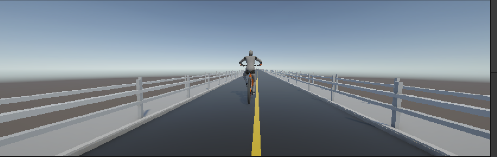

# Pedalrun

[English](README.md)

Pedalrun은 반응성 있는 자전거 조작, 도로 주행, 스테이지 기반 배달 플레이를 목표로 제작 중인 Unity 자전거 게임 프로토타입입니다.

## 주요 기능

- Unity 6 기반 자전거 이동 및 조향
- 인도와 안전 가드레일이 포함된 장거리 도로 환경
- 도로와 인도를 오갈 수 있도록 설계한 횡단보도 구간
- 충돌 시 자전거가 과도하게 날아가는 현상을 줄이는 충돌 완화 처리
- 배달 로봇, 장애물, 결승선, 스테이지 확장을 위한 기본 구조

## 조작 방법

- `W / S`: 페달 입력
- 마우스 드래그: 좌우 조향
- `Space`: 브레이크

## 현재 상태

첫 번째 자전거 도로 환경을 Unity 에디터에서 플레이할 수 있습니다. 다음 목표는 장애물, 배달 목표, HUD 피드백, WebGL 빌드를 포함한 스테이지 1의 완성입니다.

## 기술 스택

- Unity 6.3 LTS
- Universal Render Pipeline (URP)
- C#

## 개발 계획

- 스테이지 1 코스와 결승선 흐름 완성
- 안전 간격을 적용한 랜덤 장애물 배치
- 인도 위 배달 로봇 추가
- 시간, 목표, 결과 HUD 추가
- WebGL 빌드 및 배포

